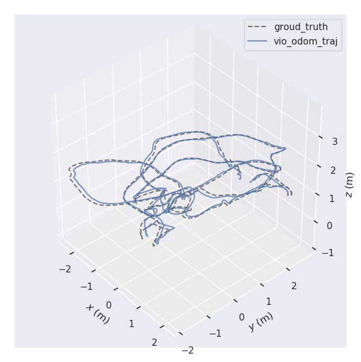
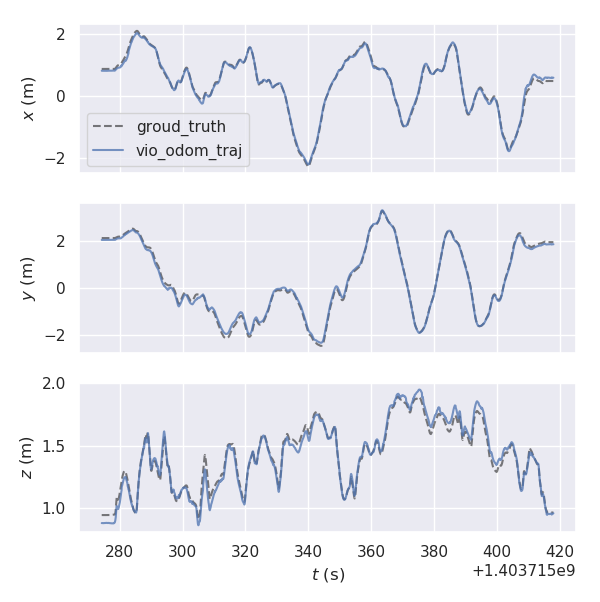

# VINS_MSCKF
***
## Introduction
$\qquad$ this program complete a VIO odometry which used stereo camera and imu sensor, referece the
VINS-mono and MSCKF_vio
***
## Reference papaer
* A Multi-State Constraint Kalman Filter
for Vision-aided Inertial Navigation
* Robust Stereo Visual Inertial Odometry for Fast Autonomous Flight
* VINS-Mono: A Robust and Versatile Monocular
Visual-Inertial State Estimator
* Indirect Kalman Filter for 3D Attitude Estimation
* Observability-constrained
Vision-aided Inertial Navigation
* Observability-based Rules for Designing
Consistent EKF SLAM Estimators

***
## Dependency
* Eigen used for matrix calculate
* OpenCV used for feature extract and img show
* SuiteSparse used for Sparse matrix calculate
* Glog used for record log
* Gtest used for google test
* Sophus library
* fmt library
* Pangolin used for traj plot
***
## Dataset

$\qquad$ program use the Euroc V1_01_easy dataset to test, befor compile the program, change the data_path in gtest/msckf_filter_test.cpp to match your local dataset path, change the FLAGS_log_dir to you local log record filepath

***
## Build program

$\qquad$ In project dir, execute following steps:

$\qquad$  mkdir build && cd build

$\qquad$  cmake ../

$\qquad$  make

$\qquad$  ./msckf_filter

a traj_data.tum file will generated after program run finished, could use evo tool to campare it with the groundtruth in Euroc Dataset
***
## Test result
$\qquad$ used evo tool to  compare the traj with groudtruth in Euroc Dataset, the instruction is:

evo_traj  tum vio_odom_traj.tum  --plot_mode 'xyz' --plot --ref groud_truth.tum  --t_max_diff 0.01 --sync -a

***
## Future work
* Porting on embedede platform(eg TX2, and use gpu do accelartion)
* The Implementation of Nonlinear sliding window Optimization
* add the visualize support in run time

